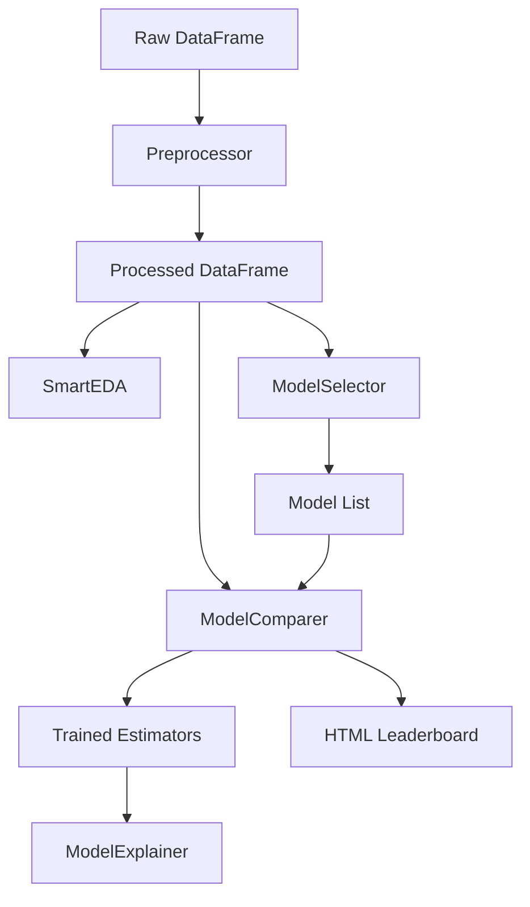
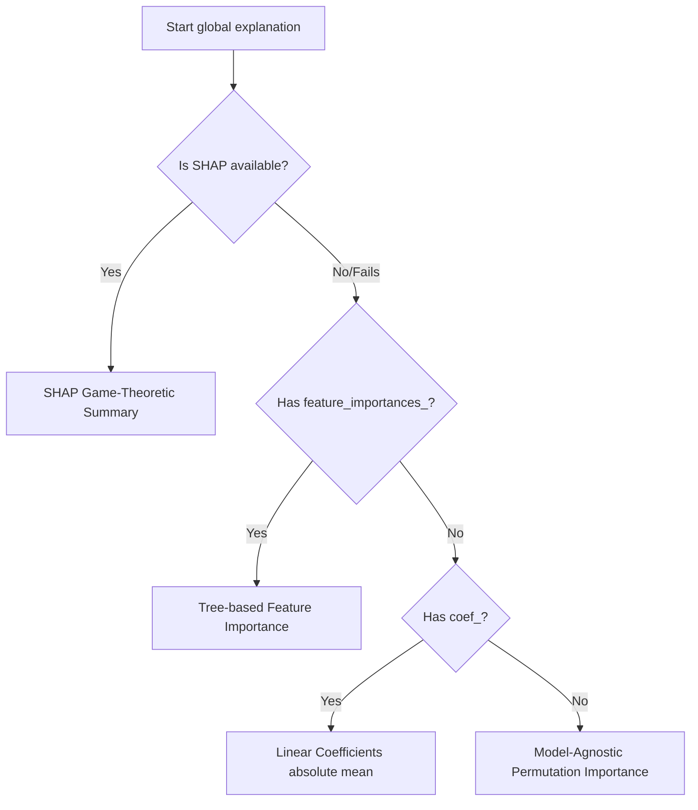

# Core Concepts

Octopy is designed to address a common problem in automated machine learning (AutoML) tools: the "black-box" abstraction. Many libraries wrap model training in complex custom classes, making it difficult to inspect, debug, or tweak the resulting estimators.

This page explains the core architectural principles that govern Octopy.

---

## 1. Direct Model Transparency

In Octopy, models are never hidden inside proprietary wrapper classes.
*   When you train a model using `PipelineBuilder`, it returns a standard scikit-learn or XGBoost estimator instance (e.g., `RandomForestClassifier`, `XGBRegressor`).
*   When you run benchmarks using `ModelComparer`, you receive a standard Python dictionary mapping the model names directly to their raw, trained scikit-learn/XGBoost objects.

This allows you to:
*   Perform hyperparameter tuning directly on the objects.
*   Serialize the models using standard tools (`pickle`, `joblib`).
*   Serve the models in production environments (e.g., using FastAPI, Flask, or cloud-native serialization engines) without importing Octopy as a production dependency.

---

## 2. Component Isolation (Modularity)

Octopy does not require you to adopt a strict end-to-end workflow. You can integrate individual components into your existing codebase:

*   If you already have a custom preprocessing pipeline, you can bypass `Preprocessor` and feed your processed pandas DataFrame directly to `ModelSelector` or `ModelComparer`.
*   If you just want quick insights on a DataFrame, you can spin up `SmartEDA` in a single line without ever training a model.
*   If you have a pre-trained model loaded from a pickle file, you can feed it directly to `ModelExplainer` or `report.generate_report` without having trained it inside Octopy.

---

## 3. Identical Split Reproducibility

To ensure that comparisons between models are mathematically fair, they must be benchmarked on identical data subsets. 
In `ModelComparer.compare()`:
1.  The train-test split is performed **once** using a user-specified seed (`random_state`) and ratio (`test_size`).
2.  The resulting partitions (`X_train`, `X_test`, `y_train`, `y_test`) are fed sequentially to all benchmarked estimators.
3.  Runtime duration and evaluation metrics are computed on the identical split, ensuring that differences in performance are due to estimator behavior, not random partition variance.

---

## 4. Graceful Fallbacks

Octopy relies on third-party packages for advanced explainability and models (such as `shap`, `xgboost`, and `lightgbm`). However, it treats these as **conditional dependencies**:

*   **Model Selection & Training**: If XGBoost or LightGBM are not installed, the library will log a warning and exclude them from recommended estimators, allowing you to train standard forest and tree models without crashing.
*   **Explainability**: The SHAP algorithm is computationally intensive and sometimes fails on certain custom model configurations. `ModelExplainer` handles this by executing a waterfall of fallback algorithms:

This design ensures that your scripts remain robust across different environments.
